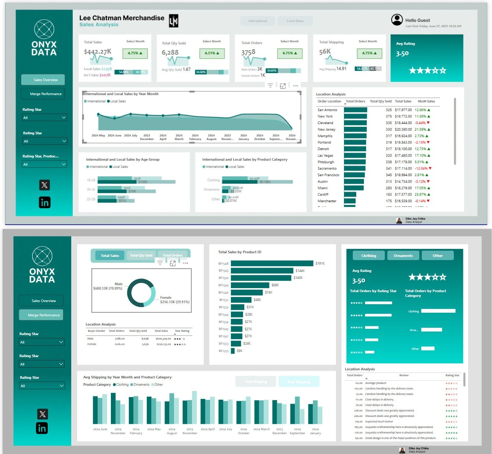

# Sales Performance Analysis
**Tools:** Power BI | DAX  
**Type:** End-to-End Sales Dashboard  
**Industry:** Retail & Merchandise

## Project Overview
Built an end-to-end sales performance dashboard 
for Lee Chatman Merchandise tracking $442K in 
revenue and 6,288 units sold across international 
and local markets.

## Key Features
- Revenue tracking across international and 
  local markets
- Location analysis across 15 cities
- Age group segmentation
- Product category breakdown
- KPI cards showing total revenue, units sold 
  and average order value

## Key Findings
- Total Revenue: $442K
- Total Units Sold: 6,288
- Markets covered: International and Local
- Cities analysed: 15

## Skills Demonstrated
- Power BI dashboard design
- DAX measures and calculations
- Geographic visualization
- Customer segmentation analysis
- KPI reporting

## Dashboard Preview

